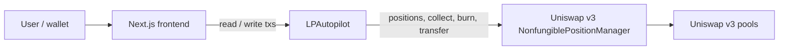

# LP Autopilot

> Autopilot for Uniswap v3 positions. Set a range rule; anyone can trigger the onchain exit when price leaves your band. You keep withdrawal rights. Fully auditable.


**Live demo**: https://lp-autopilot.vercel.app

**Contract (Arbitrum Sepolia)**: deploy with Foundry, set `NEXT_PUBLIC_LP_AUTOPILOT_ADDRESS` in the frontend, then check the contract on Arbiscan at `https://sepolia.arbiscan.io/address/<your-address>`.

## The problem

Retail LPs on Uniswap v3 lose money not because concentrated liquidity is bad, but because they stop paying attention. Positions drift out of range, fees stop accruing, impermanent loss compounds. The tools to fix this either require you to trust a centralized bot with your funds, or don't exist for small LPs at all.

## What LP Autopilot does

1. Deposit your Uniswap v3 NFT position into the Autopilot contract
2. Set a range rule in ticks (a band around the current pool tick)
3. **V1 behavior:** when price is outside that band, anyone can call `checkAndRebalance()`. The contract collects fees, removes liquidity, and holds ERC20s (the position NFT is burned; there is no automatic re-mint yet). You withdraw via `withdraw()` to receive any remaining ERC20s and, if any, the NFT. If price is still inside the band, the call reverts. You can leave at any time with `withdraw()`.

## Why this must be onchain

Three properties are non-negotiable for LP strategy tools, and none are available in a web2 architecture:

- **Custody**: the user's NFT never leaves a contract they can withdraw from unilaterally
- **Trustless execution**: no operator can front-run, censor, or misreport. Rebalance logic is immutable bytecode
- **Auditable history**: every rebalance is an onchain event anyone can verify against the pool's price history

A centralized rebalancing service requires trusting the operator with both custody and honest execution. Autopilot removes both trust assumptions.

## Architecture



## How to run locally

```bash
# Contracts
cd contracts
forge install
# Fork / integration tests use Uniswap on Arbitrum **One** mainnet; use a mainnet RPC, not Arbitrum Sepolia.
ARBITRUM_MAINNET_RPC_URL="https://arb1.arbitrum.io/rpc" forge test -vvv
# or: forge test --fork-url arbitrum_mainnet  (if ARBITRUM_MAINNET_RPC_URL is in env; see contracts/foundry.toml)

# Frontend
cd ../web
pnpm install
cp .env.example .env.local
# set NEXT_PUBLIC_WALLETCONNECT_PROJECT_ID, NEXT_PUBLIC_LP_AUTOPILOT_ADDRESS,
# and optionally NEXT_PUBLIC_LP_AUTOPILOT_DEPLOY_BLOCK (for event queries on public RPCs)
pnpm dev
```

Use `npm install` / `npm run dev` if you prefer npm (the repo ships with `package-lock.json`).

## Tech stack

- Solidity 0.8.24, Foundry, OpenZeppelin, Uniswap v3
- Next.js 14, TypeScript, Tailwind, shadcn/ui
- viem, wagmi v2, RainbowKit v2
- Deployed on Arbitrum Sepolia, frontend on Vercel

## What's next

- Chainlink Automation integration for true set-and-forget
- Multi-strategy support (TWAP-based, volatility-based)
- Mainnet deployment with audit
- Keeper reward system (small fee to whoever triggers a successful rebalance)

## Built for

MSX Hackathon 2026. Solo project. All code written during the build window (April 18–25, 2026).
